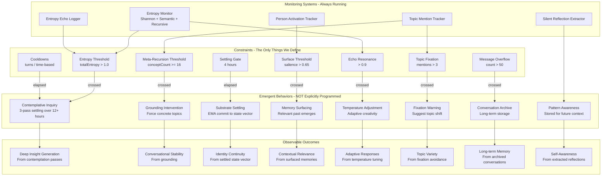
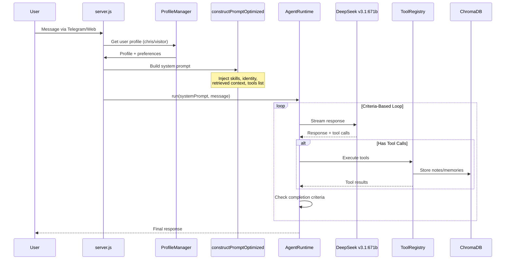
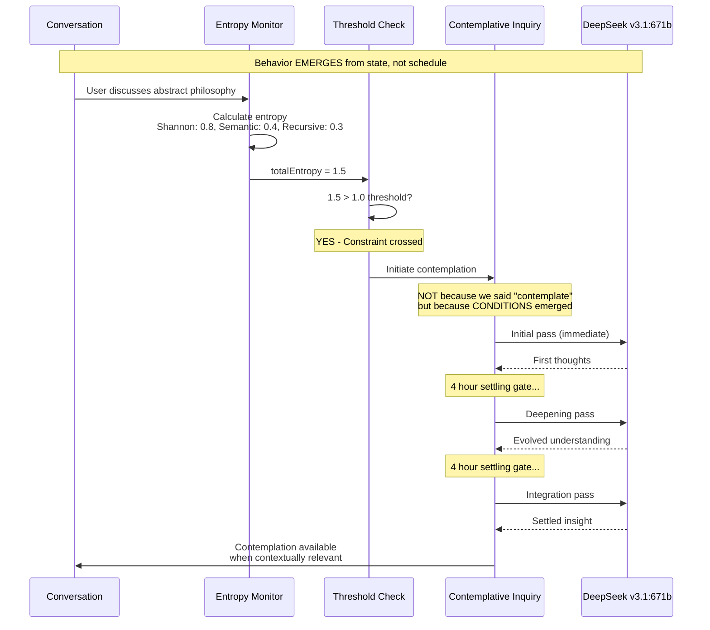

# Clint Architecture Diagrams

Visual documentation of Clint's constraint-based agent architecture.

**Last Updated:** January 30, 2026  
**Model:** DeepSeek v3.1:671b via Ollama

---

## System Overview

```mermaid
flowchart TB
    subgraph inputs [Input Channels]
        telegram[Telegram Bot]
        webui[Web UI<br>index-v2.html]
        api[REST API]
    end

    subgraph server [server.js - Main Entry Point]
        express[Express Server]
        routing[Request Routing]
        featureFlags[Feature Flags]
    end

    subgraph profiles [Profile System]
        profileMgr[ProfileManager]
        profileIso[ProfileIsolatedMemory]
        unifiedProfile[UnifiedProfileService]
    end

    subgraph prompt [Prompt Construction]
        constructPrompt[constructPromptOptimized.js]
        tokenOpt[TokenOptimizer]
        skillInjection[Skill Injection]
    end

    subgraph agent [Agent Loop]
        agentRuntime[AgentRuntime<br>Criteria-Based Completion]
        legacyLoop[Legacy Inline Loop]
        contextCompact[ContextCompactor]
    end

    subgraph tools [Tool System]
        toolRegistry[global.toolRegistry]
        toolExec[toolExecutor.js]
        toolParse[toolCallParser.js]
        
        subgraph coreTools [Core Tools]
            memWrite[memory_write]
            memRead[memory_read]
            writeCode[write_code]
            execCode[execute_code]
            createNote[create_note]
            webSearch[web_search]
            sessions[sessions_*]
        end
        
        subgraph planned [Planned]
            moltbook[moltbook<br>with sanitizer]
        end
    end

    subgraph skills [Skill System]
        skillLoader[SkillLoader]
        
        subgraph skillDirs [Skill Directories]
            workspaceSkills[skills/]
            userSkills[~/.clint/skills/]
            deliverables[deliverables/<br>Clint-created]
        end
        
        subgraph loadedSkills [Loaded Skills]
            skillCreator[skill-creator]
            narrativeUnit[narrative-unit-protocol]
            moltbookSkill[moltbook<br>planned]
        end
    end

    subgraph memory [Memory Systems]
        subgraph chromaDB [ChromaDB]
            personalMem[Personal Memories]
            contemplations[Contemplations]
            convArchive[Conversation Archives]
            notes[Notes]
        end
        
        externalMem[MEMORY.md<br>External Memory]
        clintMem[ClintMemory]
        assocMem[AssociativeMemory]
    end

    subgraph knowledge [Knowledge System]
        knowledgeSys[knowledgeSystem.js]
        retrieval[retrievalOrchestrator.js]
        intellRetrieval[IntelligentRetrieval]
    end

    subgraph identity [Identity & Reflection]
        identityEvo[IdentityEvolution]
        selfReflect[SelfReflectionSystem]
        silentReflect[SilentReflection]
        skeptic[ClintSkeptic]
    end

    subgraph llm [LLM Providers]
        deepseek[DeepSeek v3.1:671b]
        openai[OpenAI API]
        nemotron[Nemotron]
    end

    subgraph autonomous [Autonomous Systems]
        heartbeat[Heartbeat<br>Scheduled Jobs]
        taskMetab[Task Metabolism]
        contemplative[Contemplative Inquiry]
    end

    subgraph outputs [Output/Storage]
        response[Response to User]
        deliverableOut[deliverables/]
        activityLog[activity.jsonl<br>planned]
    end

    %% Input flow
    telegram --> express
    webui --> express
    api --> express
    
    %% Server routing
    express --> routing
    routing --> profileMgr
    routing --> featureFlags
    
    %% Profile to prompt
    profileMgr --> unifiedProfile
    unifiedProfile --> constructPrompt
    
    %% Prompt construction
    constructPrompt --> tokenOpt
    skillLoader --> skillInjection
    skillInjection --> constructPrompt
    knowledge --> constructPrompt
    
    %% Agent loop selection
    featureFlags -->|USE_NEW_AGENT_RUNTIME| agentRuntime
    featureFlags -->|legacy| legacyLoop
    
    %% Agent uses prompt and LLM
    constructPrompt --> agentRuntime
    agentRuntime --> deepseek
    agentRuntime --> contextCompact
    
    %% Tool execution
    agentRuntime --> toolExec
    toolExec --> toolParse
    toolParse --> toolRegistry
    toolRegistry --> coreTools
    toolRegistry --> planned
    
    %% Tools write to storage
    writeCode --> deliverableOut
    createNote --> chromaDB
    memWrite --> externalMem
    moltbook -.->|planned| activityLog
    
    %% Memory connections
    chromaDB --> knowledgeSys
    knowledgeSys --> retrieval
    retrieval --> constructPrompt
    assocMem --> constructPrompt
    
    %% Identity systems
    identityEvo --> constructPrompt
    selfReflect --> contemplations
    silentReflect --> contemplations
    
    %% Autonomous triggers
    heartbeat --> taskMetab
    heartbeat --> contemplative
    heartbeat -.->|planned| moltbookSkill
    taskMetab --> agentRuntime
    
    %% Skill loading
    workspaceSkills --> skillLoader
    userSkills --> skillLoader
    deliverables --> skillLoader
    skillLoader --> loadedSkills
    
    %% Output
    agentRuntime --> response
```



---

## Memory System

```mermaid
flowchart TB
    subgraph substrate [MetaContinuitySubstrate - Mathematical Engine]
        direction TB
        stateVector[State Vector]
        
        subgraph stateComponents [State Components]
            axiomatic[Axiomatic Weights<br>courage / word / brand]
            entropy[Entropy Intensity<br>global_tension / echo_resonance]
            anchors[Semantic Anchors<br>Top-5 by gravity score]
            bridges[Detected Bridges<br>Cross-domain synthesis]
        end
        
        subgraph relational [Relational Extension]
            personActivation[Person Activation<br>EMA-smoothed weights]
            personLearnings[Person Learnings<br>Facts + confidence]
            relationalAnchors[Relational Anchors<br>Top-3 people]
            relationalBridges[Relational Bridges<br>Cross-person patterns]
        end
        
        subgraph buffers [Metabolic Buffers]
            latentBuffer[Latent Buffer<br>Short-term subconscious]
            relationalBuffer[Relational Buffer<br>Person activation events]
        end
        
        settling[settleSubstrate<br>Every 4 hours]
        persistFile[(meta-continuity-substrate.json)]
    end

    subgraph chromaDB [ChromaDB - Vector Storage]
        collection[(clint-knowledge collection)]
        
        subgraph storedTypes [Stored Content Types]
            contemplations[Contemplations<br>Full self-reflections]
            personalMem[Personal Memories<br>type: personal-memory]
            philFoundation[Philosophical Foundation<br>type: philosophical_foundation]
            convArchiveChroma[Conversation Archives<br>subType: conversation-archive]
            notes[Notes<br>create_note tool]
            knowledge[Knowledge Docs<br>PDFs from knowledge/]
        end
    end

    subgraph associative [AssociativeMemory - Human-Analog Surfacing]
        surfaceThreshold[Surface Threshold: 0.65]
        cooldown[Cooldown: 3 turns]
        
        subgraph salience [Salience Calculation]
            emotionalMarkers[Emotional Markers<br>correction / breakthrough / intensity]
            projectRefs[Project References<br>clint / robot / entropy / etc]
            trustCircle[Trust Circle Names<br>From profiles]
        end
        
        surfacedIds[Surfaced Memory IDs<br>Avoid repetition]
    end

    subgraph working [Working Memory - ClintMemory]
        messages50[Last 50 Messages<br>Active context window]
        sessionState[Session State]
        turnCount[Turn Count]
    end

    subgraph external [External Memory - MEMORY.md]
        memoryFile[(storage/chris/external-memory/MEMORY.md)]
        
        subgraph sections [Sections]
            activeProjects[Active Projects]
            insights[Insights]
            patterns[Patterns]
        end
        
        memTools[memory_read / memory_write tools]
    end

    subgraph archive [ConversationArchiver - Long-term Storage]
        archiveDir[(conversation-archive/)]
        dailyFiles[Daily Session Files<br>YYYY-MM-DD.json]
        profileDirs[Profile Subdirectories]
    end

    subgraph profileMem [Profile-Isolated Memory]
        profileIso[ProfileIsolatedMemory]
        profileSpecific[Per-profile conversation history]
    end

    subgraph retrieval [Retrieval Orchestration]
        retrievalOrch[retrievalOrchestrator.js]
        includePersonal[includePersonalMemory flag]
        intellRetrieval[IntelligentRetrieval]
    end

    %% MetaContinuitySubstrate flows
    stateComponents --> stateVector
    relational --> stateVector
    latentBuffer -->|EMA commit| stateVector
    relationalBuffer -->|EMA commit| personActivation
    settling -->|persist| persistFile
    
    %% ChromaDB connections
    contemplations --> collection
    personalMem --> collection
    philFoundation --> collection
    convArchiveChroma --> collection
    notes --> collection
    knowledge --> collection
    
    %% AssociativeMemory uses ChromaDB
    collection -->|semantic search| associative
    associative -->|filtered by salience| surfacedIds
    
    %% Working memory cycles to archive
    messages50 -->|overflow| archive
    archive --> dailyFiles
    
    %% External memory tool access
    memTools --> memoryFile
    
    %% Profile isolation
    profileIso --> profileSpecific
    profileSpecific --> messages50
    
    %% Retrieval orchestration
    retrievalOrch --> collection
    retrievalOrch --> archive
    includePersonal -->|when true| personalMem
    intellRetrieval --> retrievalOrch
    
    %% To prompt construction
    stateVector -->|bias injection| promptConstruct[constructPromptOptimized]
    surfacedIds -->|surfaced memories| promptConstruct
    messages50 -->|conversation context| promptConstruct
    memoryFile -->|retrieved sections| promptConstruct
    retrievalOrch -->|relevant knowledge| promptConstruct
```



### Memory Types Reference

| Memory Type | Storage | Retention | Access Method |
|-------------|---------|-----------|---------------|
| **Working Memory** | ClintMemory | 50 messages | Direct in context |
| **Semantic Anchors** | MetaContinuitySubstrate | Persistent (EMA decay) | Pre-conscious biasing |
| **Person Activation** | MetaContinuitySubstrate | ~10 day decay | Relational surfacing |
| **Contemplations** | ChromaDB | Indefinite | Semantic search |
| **Personal Memories** | ChromaDB | Indefinite | `includePersonalMemory=true` |
| **Notes** | ChromaDB | Indefinite | Semantic search |
| **Knowledge Base** | ChromaDB | Indefinite | Always searched |
| **External Memory** | MEMORY.md file | Persistent | `memory_read` / `memory_write` |
| **Conversation Archive** | JSON files + ChromaDB | Indefinite | retrievalOrchestrator |

---

## Autonomous Systems & Constraint-Based Emergence

This is the "smoking gun" for constraint-based architecture: behavior EMERGES from state, not explicit programming.



### The Key Insight: Emergence vs Prescription

```
TRADITIONAL APPROACH (Prescribed):
├── if (time == 3pm) → contemplate()
├── if (user.mentions("philosophy")) → go_deep()
├── if (tuesday) → reflect()
└── Behavior is PRESCRIBED by explicit rules

CONSTRAINT-BASED APPROACH (Emergent):
├── Monitor entropy continuously
├── When entropy > threshold → contemplation EMERGES
├── When meta-concepts > 16 → grounding EMERGES  
├── When salience > 0.65 → memory surfacing EMERGES
└── Behavior EMERGES from state crossing constraints
```

The system doesn't know *when* to contemplate. Contemplation emerges when conversational state crosses an entropy threshold - like how humans don't decide "now I will think deeply" but find themselves thinking deeply when something genuinely puzzling arises.

### Autonomous Systems Reference

| System | Constraint | Emergent Behavior | Outcome |
|--------|------------|-------------------|---------|
| **ContemplativeInquiry** | Entropy > 1.0 | 3-pass thinking over 12+ hrs | Deep insights emerge |
| **MetaContinuitySubstrate** | 4-hour gate | EMA commit to state vector | Identity continuity |
| **AssociativeMemory** | Salience > 0.65 | Relevant memories surface | Contextual relevance |
| **IdentityEvolution** | Meta-concepts >= 16 | Grounding intervention | Conversational stability |
| **SilentReflection** | Pattern detected | Extract and store reflection | Self-awareness grows |
| **TopicTracker** | Mentions > 3 | Fixation warning | Topic variety |
| **EntropyEchoLogger** | Echo resonance > 0.9 | Temperature adjustment | Adaptive creativity |
| **ConversationArchiver** | Messages > 50 | Archive overflow | Long-term memory |
| **Heartbeat** | Schedule elapsed | Skill/session execution | Autonomous actions |

---

## Data Flow: Message Processing



---

## Contemplative Inquiry: Emergence in Action



---

## MetaContinuitySubstrate: Mathematical Identity

| Concept | Purpose |
|---------|---------|
| **Axiomatic Weights** | Courage, Word, Brand (0.0-1.0) - Code of the West alignment |
| **Echo Resonance** | Entropy intensity from recent interactions |
| **Semantic Anchors** | Top-5 concepts by gravity score for context priming |
| **Detected Bridges** | Cross-domain synthesis opportunities |
| **Latent Buffer** | Short-term accumulator before EMA commit |
| **Settling Gate** | 4-hour interval matching SEAL metabolism gates |
| **EMA Alpha** | 0.1 smoothing (90% old + 10% new) for stability |

---

## Philosophical Foundation

**This is phenomenological alignment**: the architecture mirrors how consciousness works - not through explicit decisions but through conditions creating the space for behavior to emerge.

The "Code of the West" (courage, word, brand) provides immutable axioms. Everything else - when to reflect, what to remember, how to respond - emerges from the interplay of constraints and state.
